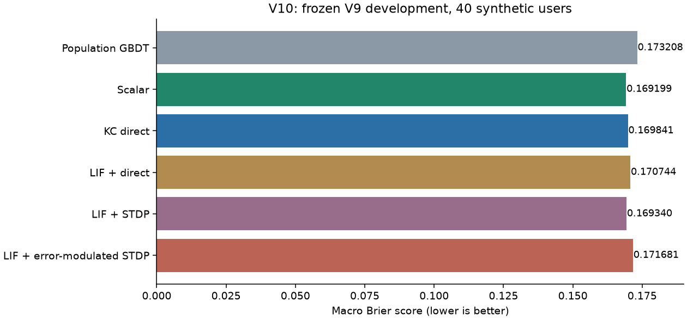
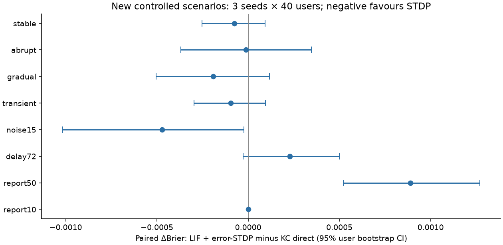
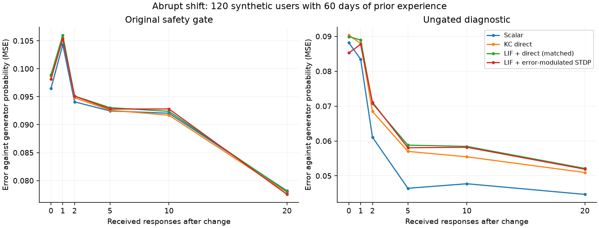

# Research V10: помогли ли LIF и локальная пластичность?

[English](results-v10.md) · [README](../README.ru.md) · [Протокол](protocol-v10.ru.md)

Дата: 7 октября 2026 года. **В проверенной реализации преимущество LIF + STDP не подтверждено.** Простая скалярная поправка дала меньшую ошибку вероятностей на прежней задаче. На новых задачах отдельные небольшие эффекты не выполнили заранее заданные условия. Это результат конкретной конечной серии, а не доказательство бесполезности спайковых сетей.

Полезный положительный результат: в контролируемой задаче первые изменения качества после одного-двух новых ответов обнаружились и у обычной памяти. Спайки для этого не оказались необходимыми. Освоение нового режима за два ответа и польза на реальных людях не установлены.

## Что выполнено

- Точный листинг [ToxaBes](https://habr.com/ru/articles/1045696/) проверен на CPU и MPS, seeds 7/17/27. Полное обучение MNIST (40 эпох) и заявленная автором accuracy не воспроизводились: проверены исполняемые механизмы.
- Самостоятельный V9 повторён: пять основных macro-метрик всех шести моделей совпали с архивом точно. Прежний отрицательный допуск сохранился.
- 35 заранее заданных конфигураций рассмотрены на 10 tuning-пользователях; пороги выбраны на 10 других calibration-пользователях. Зафиксированы 8 вариантов, включая 2 matched-контроля. Затем оценены 40 известных V9 development-пользователей.
- Восемь новых контролируемых сценариев, 3 seeds, 40 пользователей × 120 решений на seed: 115200 сценарных решений на вариант. Одни и те же 120 синтетических пользователей переиспользованы между сценариями; это не 960 независимых людей.
- Основная серия заняла 239.68с. Независимый повтор всех 8 × 7200 development-прогнозов совпал точно; проверены 284 артефакта. Проверки: 38 тестов V8/V9 и 31 подслучай, 14 тестов механизмов V10, 7 тестов листинга автора; Ruff, сборка sdist/wheel, импорт из wheel и pip check прошли.

## Что перенесено из рекомендации

Внутренний LIF повторяет принцип накопления тока, утечки, порога и сброса. Перебраны 5 профилей времени/усиления и 2 скорости обучения. Сравнены обновление error×rate, парная STDP и парная STDP×prediction error. Последний вариант — наша инженерная гипотеза о третьем факторе, не готовое правило из статьи.

Общая вероятность GBDT и входная KC-кодировка одинаковы. Личная память, задержки, ограничения поправки и гейт одинаковы; matched-контроли используют те же LIF-параметры и learning rate. Самостоятельная MB-модель V9 воспроизведена отдельно и не подменяется GBDT в историческом отчёте.

Реализация V10 отличается от авторской сети: фиксированные KC-входы, 32 детерминированных внутренних такта на событие, персональный readout и сохранённая eligibility для позднего ответа. У автора — кортикальные модули, Poisson-кодирование и межмодульная пластичность. У нас пост-импульсы задаются общим p0; рекуррентная спайковая память между ежедневными событиями и обучение encoder через surrogate gradient не реализованы. Глобальная модель не переобучается спайковым методом.

## Проверка листинга автора

| Проверка | Наблюдение | Следствие |
| --- | --- | --- |
| Gradient / AdamW | `input_scale` и веса колонок не получили gradient; readout и interweights обновляются | Листинг совместим с фиксированным reservoir, но не с обучением всех названных параметров обычным backprop |
| Дополнительный rate loss | `requires_grad=False` | Эта часть loss не даёт регуляризирующего градиента |
| Повтор eval | Logits менялись примерно на 0.0015–0.0028; восстановление EMA устранило расхождение | Оценка зависит от изменяемого `spike_rate_avg`; argmax в проверенных batches не изменился |
| Короткая STDP-серия | Веса изменились примерно на 3–5×10⁻⁸ за 3 batches; logits в этих float32 проходах не изменились | Нельзя приписывать показанную accuracy именно STDP; длительное обучение здесь не проверялось |
| Связность | Изменение interweights меняет выходные признаки, но не входы/спайки/mem/syn колонок | В листинге нет обратной подачи этой модуляции в LIF |
| Создание связей | Максимальная корреляция 0.63501 при стандартном threshold 0.8 | Стандартный механизм формирования новых связей не достигает порога; проверено 1000 максимальными обновлениями |

Точные численные проверки, SHA256 листинга и ограничения сохранены в [аудите](../results/v10-author-audit/summary.json). Чужой полный листинг не включён в распространяемый код.

## Прежняя задача: вероятности и предупреждения

| Модель | Brier ↓ | AUC ↑ | Recall | FPR | J | Поймано / ложных, лимит 2 за 7 дней |
| --- | --- | --- | --- | --- | --- | --- |
| Population GBDT | 0.173208 | 0.739105 | 42.48% | 17.57% | 0.249087 | 993 / 170 |
| Scalar | 0.169199 | 0.735216 | 43.22% | 19.29% | 0.239319 | 1004 / 162 |
| KC direct | 0.169841 | 0.735187 | 43.19% | 19.52% | 0.236731 | 1002 / 170 |
| LIF + direct | 0.170744 | 0.735160 | 43.54% | 19.52% | 0.240252 | 1010 / 168 |
| LIF + STDP | 0.169340 | 0.736832 | 43.11% | 19.28% | 0.238356 | 1003 / 165 |
| LIF + error-modulated STDP | 0.171681 | 0.738213 | 42.08% | 18.33% | 0.237487 | 982 / 169 |

В этой таблице первичная метрика — Brier (меньше лучше). Личный scalar уменьшил Brier, но снизил AUC и J относительно population. Поэтому даже лучший Brier не означает, что задача полезных предупреждений решена. V10 выбирает пороги на 10 пользователях, V9 выбирал на 20: recall/FPR нельзя напрямую сопоставлять между версиями как эффект модели.

LIF+rSTDP против обычной KC-памяти: ΔBrier **+0.001840 [+0.000439; +0.003532]**. Против scalar: **+0.002482 [+0.000630; +0.004846]**. Против LIF с теми же параметрами, но direct-обновлением: **+0.000937 [+0.000098; +0.001952]**. Здесь положительная разница означает ухудшение.



## Новые контролируемые сценарии

| Сценарий | ΔBrier vs KC direct, 95% CI | ΔBrier vs matched LIF direct |
| --- | --- | --- |
| stable | -0.000075 [-0.000252; +0.000093] | -0.000194 [-0.000398; +0.000009] |
| abrupt | -0.000011 [-0.000369; +0.000346] | -0.000300 [-0.000651; +0.000071] |
| gradual | -0.000192 [-0.000505; +0.000118] | -0.000467 [-0.000789; -0.000146] |
| transient | -0.000096 [-0.000297; +0.000095] | -0.000228 [-0.000490; -0.000001] |
| noise15 | -0.000471 [-0.001017; -0.000023] | -0.000738 [-0.001354; -0.000227] |
| delay72 | +0.000229 [-0.000027; +0.000499] | -0.000316 [-0.000592; -0.000029] |
| report50 | +0.000889 [+0.000522; +0.001269] | -0.000138 [-0.000493; +0.000195] |
| report10 | +0.000000 [+0.000000; +0.000000] | +0.000000 [+0.000000; +0.000000] |

Это разности gated Brier кандидата и соответствующего baseline, с парными 95% интервалами по людям. Шум/задержка/пропуски накладываются на abrupt, поэтому их контроль — abrupt. При delivery 72h используется порядок V9 «прогноз раньше ответа с тем же timestamp»; первый использующий ответ ежедневный прогноз происходит через 96 часов.

В noise15 есть небольшой выигрыш относительно KC direct, но он меньше заданного 0.002, является вторичным сравнением и не проходит как общее подтверждение. В report50 ошибка выше. При report10 гейт не разрешил личную коррекцию и gated-прогнозы совпали. Наблюдаемые эффекты не обосновывают выбор исключительно удачного сценария.



## Один-два новых ответа: что можно утверждать

К моменту резкой смены режима у моделей уже есть 60 дней опыта. Первое сравнение с population не изолирует новые ответы. Поэтому после основной оценки выполнен диагностический контроль без подбора: те же модели и события, но у контрольной копии отключены только ответы после смены режима. Предшествующие прогнозы совпали точно.

| Модель | После 1 ответа: ΔBrier, 95% ДИ | После 2 ответов: ΔBrier, 95% ДИ |
| --- | --- | --- |
| Scalar | -0.000438 [-0.001879; +0.001636] | -0.002445 [-0.004448; -0.000649] |
| KC direct | -0.002873 [-0.004805; -0.001106] | -0.005116 [-0.008713; -0.001837] |
| LIF + direct (matched) | -0.002773 [-0.004570; -0.001232] | -0.005580 [-0.009141; -0.002305] |
| LIF + error-modulated STDP | -0.002293 [-0.004066; -0.000744] | -0.004515 [-0.007318; -0.001882] |

Отрицательная разница означает пользу продолжения обучения относительно собственной копии без новых ответов. В этой синтетической задаче эффект после 1–2 ответов есть у нескольких методов. Он **не специфичен для спайков**. Прямое сравнение rSTDP с KC direct после двух ответов: ΔBrier **+0.000742 [-0.000748; +0.002322]** — преимущество не установлено.

Для совершенно новой памяти gated-прогноз после первых 1–2 ответов совпадает с population: действует минимум 12 эффективных наблюдений и другие условия допуска. Ungated-результат — отдельная диагностика, выбранные настройки не подбирались специально для неё. Улучшение относительно замороженной памяти не означает полного освоения нового режима; порог «достаточного качества» такой адаптации не был задан.



## Почему результат мог оказаться таким

После оценки, без изменения весов или повторного подбора, измерена геометрия выбранного следа. Средний cosine eligibility/rate равен -0.210; в 75.6% событий направления противоположны. Парная STDP не обязана совпадать с направлением уменьшения ошибки логистического readout. Умножение произвольного знакового следа на prediction error само по себе такого совпадения не гарантирует. Это конкретная зацепка для проектирования третьего фактора, а не объяснение всех SNN.

Выбранная LIF-кодировка активирует в среднем 53.5 элементов против 101 исходного KC-кода. Следовательно, она также меняет геометрию признаков; выигрыш от спайков не следует из одного уменьшения активности.

Все варианты ограничены поправкой ±0.7 логита. Диагностика с известной вероятностью генератора показывает недостижимую при таком ограничении часть адаптации. Этот evaluator-only предел сохранён в verification.json; модель скрытую вероятность не получает. Нельзя автоматически ослабить ограничение после просмотра результата и считать это прежним экспериментом.

## Стоимость и размер состояния

| Модель | Числовые байты на пользователя | Байты JSON, минимум–максимум | Replay, мкс на решение | Кодирование, мкс на решение |
| --- | --- | --- | --- | --- |
| Scalar | 24 | 14,388–17,125 | 77.2 | 0.0 |
| KC direct | 48480 | 73,271–103,740 | 135.1 | 0.0 |
| LIF + direct | 48480 | 67,758–93,452 | 120.5 | 355.0 |
| LIF + STDP | 48480 | 73,262–104,396 | 136.2 | 376.0 |
| LIF + error-modulated STDP | 48480 | 68,108–93,397 | 121.2 | 321.0 |

Измерено на локальном macOS arm64, один CPU-поток для NumPy, 180 дней V9. Replay включает Python-обвязку и финальную сериализацию состояния, но не обучение и вычисление общего GBDT p0. Encoding — отдельная добавочная цена LIF; базовое KC-преобразование в этой колонке не учитывается. Это исследовательское измерение, не SLA и не нагрузочный тест миллиона пользователей.

Для KC/LIF три числовых массива по 2020 float64 по-прежнему занимают 48480 байт (47.34 KiB). Полный JSON больше и зависит от истории/pending/seen. V10 дополнительно сохраняет eligibility ожидающего ответа; память процесса, gzip, квантизация и production-хранилище не измерены. Цель 16 KiB полного состояния не достигнута.

## Воспроизводимость, ошибки и границы

Первый независимый checker упал из-за требования точного равенства `sigmoid(logit(p0)) == p0`. Измеренный round-trip максимум 1.11×10⁻¹⁶, gated-прогноз совпал точно. Исправлен только checker: допуск 1e−14 для ungated round-trip, сохранены [первый журнал](../results/v10/verification/recheck.log) и [успешный повтор](../results/v10/verification/recheck-retry1.log). Модели, выбранные настройки и основной архив не менялись. Исправленный checker имеет отдельный SHA256; снимок main сохраняет его прежний вариант.

Данные синтетические. V9 development уже известен. Новые seeds проверяют перенос внутри специально заданного генератора; параметры перенесены с 2020 на 33 координаты без нового подбора. Полные метки calibration идеализированы. Несколько вторичных сравнений не имеют поправки на множественность. Вывод ограничен выбранным диапазоном LIF и конкретным readout; 40 эпох MNIST, нейроморфное железо, клиническая польза и предотвращение событий не проверялись.

## Вывод и следующий исследовательский вопрос

`recommendation_supported=false`: условия не выполнены относительно matched LIF direct, KC direct и scalar. Внедрять этот SNN-вариант как улучшение текущего предиктора оснований нет. Рекомендация дала полезный эксперимент и выявила проблему выбора сигнала обучения. Следующее отдельное исследование может заранее сравнить иное, обоснованное правило eligibility/модулятора и сохранение временной динамики между событиями с обычной памятью. Для такого шага нужен новый протокол и новая оценочная когорта, а не дальнейший подбор на результатах V10.

## Повторить эксперимент

```bash
python3.12 -m venv .venv
source .venv/bin/activate
python -m pip install -r requirements-v10.txt
python -m pip install --no-deps -e .
python -m pytest research_v8 research_v9 research_v10/test_mechanisms.py -q
OPENBLAS_NUM_THREADS=1 OMP_NUM_THREADS=1 VECLIB_MAXIMUM_THREADS=1 \
  python -m research_v10.experiment --output-dir runs/v10-new
python -m research_v10.verify --run runs/v10-new --output-dir runs/v10-new-check
python -m research_v10.followup --run runs/v10-new --output runs/v10-new-counterfactual.json
```


Для аудита автора сначала сохраните HTML статьи во временный файл, прочитайте извлечённый листинг и используйте `python -m research_v10.author_audit --help`. Аудитор принимает только проверенный SHA256 и требует `--execute-reviewed-snapshot`; тесты листинга читают путь из `V10_AUTHOR_SOURCE` и пропускаются, если временного файла нет. V10 runtime не требует Torch: он нужен для отдельного аудита автора.

Для новых запусков нужны новые каталоги. [Точные зависимости](../requirements-v10.txt) относятся к проверенной платформе; переносимость всего диапазона версий не заявляется.

## Артефакты

- [Зафиксированные настройки и пороги](../results/v10/run-20261007/frozen.json)
- [Все попытки подбора](../results/v10/run-20261007/tuning.json)
- [Основной результат](../results/v10/run-20261007/summary.json)
- [Парные сравнения на development](../results/v10/run-20261007/development_comparisons.json)
- [Независимая проверка и решение](../results/v10/recheck-20261007-retry1/verification.json)
- [Парные сравнения после первых ответов](../results/v10/recheck-20261007-retry1/few-shot-paired.json)
- [Контроль новых ответов и холодного старта](../results/v10/verification/counterfactual.json)
- [Диагностика представления](../results/v10/verification/representation-diagnostic.json)
- [Аудит автора и происхождение листинга](../results/v10-author-audit/summary.json)
- [Контрольные суммы всех артефактов](../results/v10/run-20261007/artifact_manifest.json)
